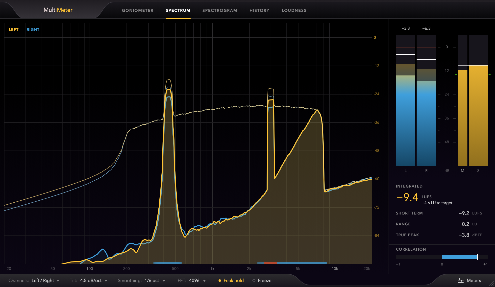
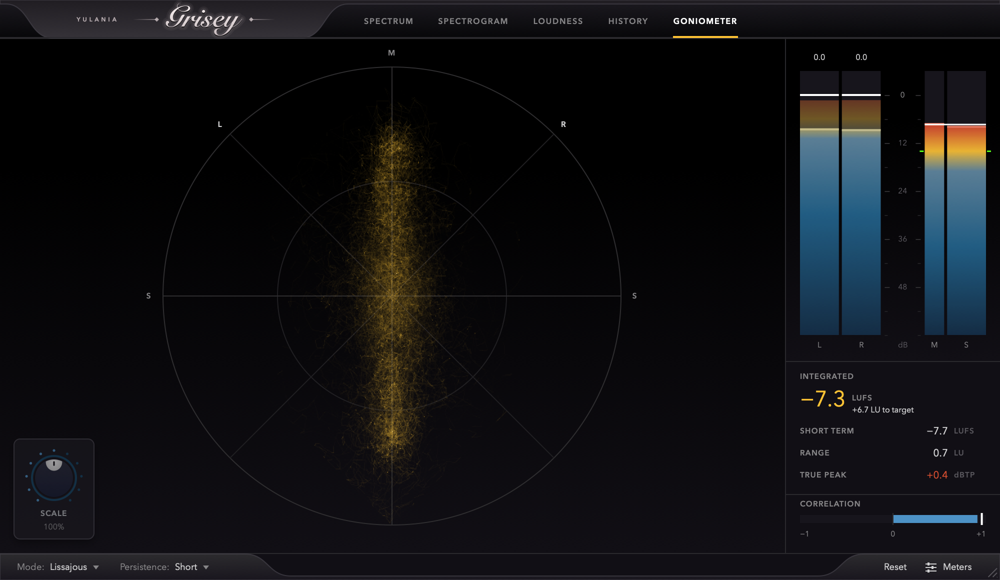
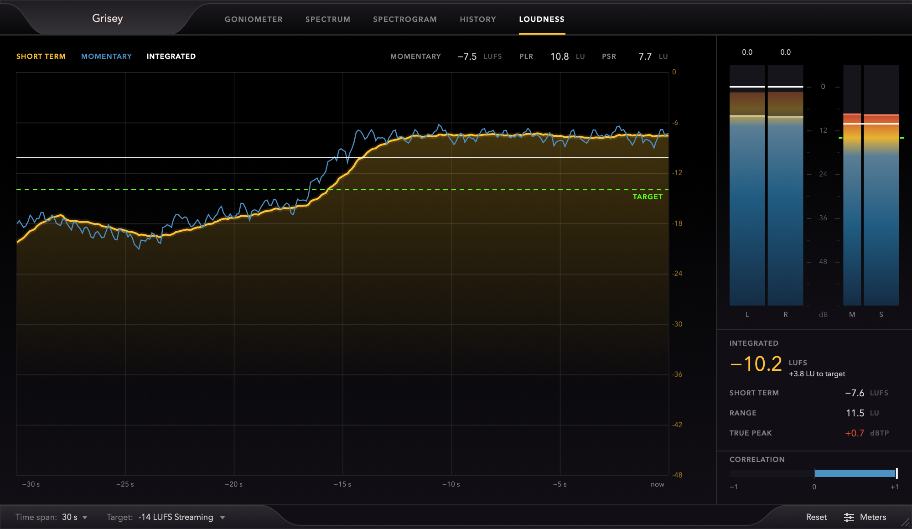
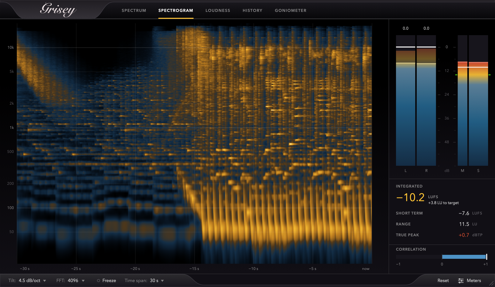

# Grisey

Grisey is a free, open-source metering plugin for mixing and mastering. One resizable window shows the level, the loudness, the spectrum, the stereo image, and the phase correlation of what is playing through it. It runs as a VST3, AU, or CLAP plugin, or as a standalone app, on macOS and Windows.

**Status:** version 2.0 is in beta. It has been tested as a standalone app and in JUCE's AudioPluginHost on macOS. It has not yet been tried in every host, or much on Windows, so reports from either are welcome in the [issues](https://github.com/RealAlexZ/MultiMeter/issues).



| Goniometer | Loudness | Spectrogram |
| --- | --- | --- |
|  |  |  |

## Features

### Always in view
- Level bars for each channel: the RMS level, the peak level above it, and ticks that hold the highest peak. Every level is measured on the audio thread from every sample, so no peak is missed between frames.
- Loudness bars for the momentary and short-term loudness, with the integrated loudness and the target marked on them.
- The integrated and short-term loudness, the loudness range, and the true peak as numbers.
- The correlation of the channels, from +1 (in phase) through 0 (wide stereo) to -1 (out of phase), as a fast and a slow reading.

### Loudness
- Momentary, short-term, and integrated loudness, and loudness range, to ITU-R BS.1770-4 and EBU R 128.
- True peak with 4x oversampling, the peak to loudness ratio (PLR), and the peak to short-term loudness ratio (PSR).
- A history graph, and delivery targets for streaming, podcasts, EBU R 128, and ATSC A/85.
- Tested against the synthesized signals of EBU Tech 3341 and Tech 3342.

### Spectrum
- FFT sizes from 2048 to 16384 points, scaled so that a full-scale sine reads 0 dB.
- Left / right or mid / side, adjustable tilt, fractional-octave smoothing, peak hold, and freeze.
- A correlation strip along the bottom shows, band by band, where the channels are in phase and where they are out of phase.
- Under the mouse: the frequency, the nearest note, and the level.

### Spectrogram
- Frequency content over time, on a logarithmic frequency axis.

### One timeline
- The spectrogram, the history and the loudness graph share one timeline. They all keep recording whichever view is showing, and they all show the same span of time (15, 30 or 60 s), so the same moment is in the same place when you switch between them.
- Resizing the window or changing the span keeps what has been recorded.

### Goniometer
- The stereo image with phosphor-style persistence, as a Lissajous or a polar plot.

### History
- The peak and RMS levels over time.

### Interface, formats and settings
- A resizable interface inspired by FabFilter's plugins, which redraws at 30 or 60 frames per second.
- VST3, AU, CLAP, and Standalone. Mono and stereo.
- Every setting is saved with the session, and sessions saved by version 1, when it was called MultiMeter, still load.

## Installing

Grisey needs macOS 10.15 or later (Apple Silicon or Intel), or 64-bit Windows 10 or later.

Download the zip for your system from the [releases page](https://github.com/RealAlexZ/MultiMeter/releases), and copy what you need:

| | macOS | Windows |
| --- | --- | --- |
| VST3 | `~/Library/Audio/Plug-Ins/VST3` | `C:\Program Files\Common Files\VST3` |
| AU | `~/Library/Audio/Plug-Ins/Components` | |
| CLAP | `~/Library/Audio/Plug-Ins/CLAP` | `C:\Program Files\Common Files\CLAP` |

The builds are not signed or notarized, so macOS will refuse to load them until you clear the
quarantine flag that it puts on downloads. After copying, run this for each plugin you installed:

```bash
xattr -dr com.apple.quarantine ~/Library/Audio/Plug-Ins/VST3/Grisey.vst3
```

On Windows, SmartScreen may warn about the standalone app; choose "More info", then "Run anyway".
If you would rather not run unsigned builds, build from source as described below.

## Building

Grisey builds with CMake 3.22 or later and a C++20 compiler. JUCE 9 and
clap-juce-extensions are included as git submodules.

```bash
git clone --recurse-submodules https://github.com/RealAlexZ/MultiMeter.git
cd MultiMeter
cmake -B build -DCMAKE_BUILD_TYPE=Release
cmake --build build --config Release --parallel
```

The VST3, AU (macOS only), CLAP, and Standalone builds are written to
`build/Grisey_artefacts/Release`. Add `-DGRISEY_COPY_AFTER_BUILD=ON` to install them
into your user plugin folders as part of the build.

To run the unit tests:

```bash
ctest --test-dir build -C Release --output-on-failure
```

## Developing

[ROADMAP.md](ROADMAP.md) records what version 2.0 changed and why, with the measurements behind the decisions, and what is still to do.

The measurement code in `Source/Engine` does not depend on the interface, and is covered by the unit tests, which include the synthesized test signals of EBU Tech 3341 and Tech 3342.

To save a picture of the editor running a test signal, without opening a host:

```bash
build/GriseySnapshot_artefacts/Release/GriseySnapshot editor.png 4
```

The number picks the view (0 goniometer, 1 spectrum, 2 spectrogram, 3 history, 4 loudness).
Parameters can be set by their IDs, for example `spectrumChannels=1`, and `size=1400x800` sets the
size of the editor. `also=2,3` stops the audio and then saves those views as well, all of the same
moment, which shows what each view recorded while it was hidden. The tool's window ignores the mouse, so that it cannot take a click that was
meant for something else.

## The name, and version 1

Grisey is named after Gérard Grisey, the composer who made the spectrum of a sound the material of his music.

Up to version 1 it was called MultiMeter. Hosts know a plugin by its codes rather than by its name, and Grisey has kept MultiMeter's, so a session that was saved with MultiMeter opens with Grisey in its place, with its settings. For the same reason the two cannot be installed side by side.

## Licence and credits

Grisey is free software under the GPLv3 (see [LICENSE.md](LICENSE.md)). It is built with
[JUCE](https://juce.com) 9, used under the AGPLv3, and
[clap-juce-extensions](https://github.com/free-audio/clap-juce-extensions).

The look of the interface is inspired by FabFilter's plugins. Grisey is an independent project:
it is not made, endorsed, or supported by FabFilter, and it uses none of their artwork or code.
